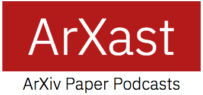

Generate podcast versions of papers which you can listen to easily.

### Sample Podcasts
Asymmetric Actor Critic for Image-Based Robot Learning (https://vocaroo.com/i/s1SnDBsI0Ee0)

Ensure to create the temp directory, by using `mkdir tmp` on the root directory.
(This will be later fixed in a later iteration).

### TODO/Future Task:
- [x] Fix parser and implement better audio stitching method.
- [ ] Perform parser tests against different paper formats.
- [ ] Migrate ArXiv Vanity parser in self contained system.
- [ ] Parse author information and include in script.
- [ ] Append methods for better parameterization.
- [ ] Include multilingual support with auto translation.
- [ ] Develop web service/streaming radio (YouTube?)
